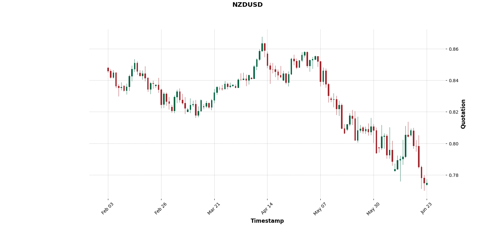

# <span style="font-size:1.5em;">FOREX DATA</span>

[](https://nikfio.github.io/forex_data/)
[](https://circleci.com/gh/nikfio/forex_data)
[](https://pypi.org/project/forex-data-aggregator/)
[](https://www.python.org/)
[](https://python-poetry.org/)

> 📚 **[View Full Documentation](https://nikfio.github.io/forex_data/)** | 🚀 **[Quick Start](#installation)** | 💡 **[Examples](#examples)**

The forex_data package offers ways to aggregate data from the Forex market into a dataframe having the the essential OHLC information, so the ouput will always have the columns:

* timestamp
* open
* high
* low
* close

The purpose is to aggregate data in OHLC format from multiple sources, optimize data caching and provide an interface to easily access and use the data: the main outcome from the interface is a dataframe.

At the moment, sources are divided in **historical sources** and **real-time sources**.

## SOURCES

### HISTORICAL SOURCE

A historical source provides data tipically from the first years of 2000s and the free tier is fine for the purposes of the package. The update rate is slow but data can be retrived with a low resolution like 1-minute timeframe.

The historical source used in the package is [histdata.com](http://www.histdata.com/), which work is really genuine and a lot appreciated.

Summarizing, a historical source can provide tons of data even from many years ago and with no limits at the downside of a slow update rate. For example, *histdata* updates data on a montly basis.

### REAL-TIME SOURCE

A real-time source is what is more tipically known as a source for forex market or stock market data. It offers APIs in determined clients or even just a minimal documentation to establish the API call in HTTP request format.
A minimal free or trial offering is proposed, but they rely on premium subscriptions offers based on:

* real time performance 
* size of tickers list available
* how much history of a ticker 
* and many other parameters ...

As of now, [Twelve Data](https://twelvedata.com/) is integrated for real-time market data access. The intention is to make the most out of their free tier access to data.

## INSTALLATION

### From PyPI (Recommended)

The easiest way to install forex_data is via pip:

```bash
pip install forex-data-aggregator
```

Or with Poetry:

```bash
poetry add forex-data-aggregator
```

### From Source

If you want to install from source or contribute to development:

1. Ensure you have [Poetry](https://python-poetry.org/docs/) installed
2. Clone the repository:
```bash
git clone https://github.com/nikfio/forex_data.git -b master forex-data
cd forex-data
```
3. Install dependencies:
```bash
poetry install
```
4. Run tests to verify installation:
```bash
poetry run pytest
```

## DOCUMENTATION

📖 **Comprehensive documentation is available at [nikfio.github.io/forex_data](https://nikfio.github.io/forex_data/)**

The full documentation includes:

- **[Installation Guide](https://nikfio.github.io/forex_data/installation.html)** - Detailed setup instructions
- **[Quick Start Tutorial](https://nikfio.github.io/forex_data/quickstart.html)** - Get started in minutes
- **[Configuration Reference](https://nikfio.github.io/forex_data/configuration.html)** - All configuration options explained
- **[API Reference](https://nikfio.github.io/forex_data/forex_data.html)** - Complete API documentation with type hints
- **[Code Examples](https://nikfio.github.io/forex_data/examples.html)** - 15+ comprehensive examples
- **[Contributing Guide](https://nikfio.github.io/forex_data/contributing.html)** - How to contribute to the project
- **[Changelog](https://nikfio.github.io/forex_data/changelog.html)** - Version history and updates

## CONFIGURATION FILE

A configuration file can be passed in order to group fixed parameters values.
In repository folder clone, look for [appconfig folder](appconfig) to see the [example template file](appconfig/appconfig_template.yaml).

In data managers instantiation, you can pass directly the absolute path to the YAML file or also a folder.
In the second case, it will look for the configuration file ending with `data_config.yaml` in the specified folder.
Furthermore, any parameter value can be overridden by explicit assignment in object instantion.
The feature will be more clear following the [examples section](#examples).

#### ENGINE

Available options:

* pandas
* pyarrow
* polars
* polars_lazy

#### DATA_FILETYPE

Available options:

* csv
* parquet

*parquet* filetype is strongly suggested for read/write speed and disk space occupation.
Meanwhile, if you have any analysis application outside the Python environment, it would more likely accept csv files over parquet: so *csv* filetype could be a better choice for its broader acceptance.

#### DATA_PATH

Specifies the absolute directory path where the downloaded data files will be stored.
If not provided, a default location is used (`~/.database/`).

#### PROVIDERS_KEY

To use real-time sources you need to provide an API key.

Look here to register and create a key from Twelve Data provider
[Twelve Data API registration](https://twelvedata.com/)

## LOGGING

Logging feature is added via loguru library.
By construction log is dumped in a file which location is determined by pathlib.
A generic usage folder for the package named `.database` is created at the current user home folder.
Here log is dumped in a file called `forexdata.log`, the complete location of the log file will be:

`~/.database/forexdata.log`

## EXAMPLES

You can find complete working examples in the [examples folder](examples/) showing the various modules and functionalities the package offers.

To run the examples:

```bash
# Historical data example
poetry run python examples/histdata_db_manager.py

# Real-time data example (requires Twelve Data API key as environment variable)
export TWELVE_DATA_API_KEY="your_key_here"
poetry run python examples/realtime/realtime_twelvedata_connector.py
```

#### Historical data 

Let's walk through the [example for historical data source](examples/histdata_db_manager.py):

1. **Configuration setup**
    ```python
    # Use a runtime defined config yaml file
    test_config_yaml = '''
    DATA_FILETYPE: 'parquet'
    
    ENGINE: 'polars_lazy'
    
    DATA_PATH: 'ABSOLUTE-PATH-TO-DATA-DIRECTORY'
    '''
    ```
    You can define configuration inline or use a file. The configuration can override specific settings.
<br>

2. **Data manager instance** 
    ```python
    from forex_data import HistoricalManagerDB
    
    histmanager = HistoricalManagerDB(
        config=test_config_yaml
    )
    ```
    Create an instance of the historical data manager with your configuration.
<br>

3. **Get data**
    ```python
    ex_ticker = 'EURUSD'
    ex_timeframe = '1d'
    ex_start_date = '2018-10-03 10:00:00'
    ex_end_date = '2018-12-03 10:00:00'
    
    yeardata = histmanager.get_data(
        ticker=ex_ticker,
        timeframe=ex_timeframe,
        start=ex_start_date,
        end=ex_end_date
    )
    ```
    The call returns a dataframe with data having the timeframe, start, and end specified by the inputs.
    The output dataframe type depends on the engine selected (polars_lazy, polars, pandas, pyarrow).

    With `polars_lazy` as ENGINE option, the output dataframe:
    ```
    ┌─────────────────────┬─────────┬─────────┬─────────┬─────────┐
    │ timestamp           ┆ open    ┆ high    ┆ low     ┆ close   │
    │ ---                 ┆ ---     ┆ ---     ┆ ---     ┆ ---     │
    │ datetime[ms]        ┆ f32     ┆ f32     ┆ f32     ┆ f32     │
    ╞═════════════════════╪═════════╪═════════╪═════════╪═════════╡
    │ 2018-10-03 21:00:00 ┆ 1.1523  ┆ 1.1528  ┆ 1.1512  ┆ 1.1516  │
    │ 2018-10-04 21:00:00 ┆ 1.1516  ┆ 1.1539  ┆ 1.1485  ┆ 1.1498  │
    │ 2018-10-05 21:00:00 ┆ 1.1498  ┆ 1.1534  ┆ 1.1486  ┆ 1.1514  │
    │ ...                 ┆ ...     ┆ ...     ┆ ...     ┆ ...     │
    └─────────────────────┴─────────┴─────────┴─────────┴─────────┘
    ```
<br>

4. **Add a timeframe**
    ```python
    histmanager.add_timeframe('1W')
    ```
    Add a new timeframe. The data manager will create and cache the new timeframe data if not already present.
<br>

5. **Plot data**
    ```python
    histmanager.plot(
        ticker=ex_ticker,
        timeframe='1D',
        start_date='2016-02-02 18:00:00',
        end_date='2016-06-23 23:00:00'
    )
    ```
    Generate a candlestick chart for the specified ticker and date range.

<br>



<br>

6. **Conditional Data Retrieval**

    You can filter data directly during retrieval using SQL-like conditions.

    ```python
    from forex_data import (
        HistoricalManagerDB, 
        COLUMN_NAME, 
        SQL_COMPARISON_OPERATORS
    )

    # 1. Simple condition: OPEN < 1.13
    data = histmanager.get_data(
        ticker='EURUSD',
        timeframe='1D',
        start='2018-01-01',
        end='2018-12-31',
        comparison_column_name=COLUMN_NAME.OPEN,
        check_level=1.13,
        comparison_operator=SQL_COMPARISON_OPERATORS.LESS_THAN
    )

    # 2. Multiple conditions (OR): HIGH > 1.145 OR LOW < 1.12
    from forex_data import SQL_CONDITION_AGGREGATION_MODES

    data = histmanager.get_data(
        ticker='EURUSD',
        timeframe='1D',
        start='2019-01-01',
        end='2019-12-31',
        comparison_column_name=[
            COLUMN_NAME.HIGH, 
            COLUMN_NAME.LOW
        ],
        check_level=[1.145, 1.12],
        comparison_operator=[
            SQL_COMPARISON_OPERATORS.GREATER_THAN, 
            SQL_COMPARISON_OPERATORS.LESS_THAN
        ],
        aggregation_mode=SQL_CONDITION_AGGREGATION_MODES.OR
    )
    ```

<br>

#### Real-Time data

Let's walk through the [example for real-time data source](examples/realtime/realtime_twelvedata_connector.py):

**Important:** This example requires Twelve Data API key set as an environment variable:
```bash
export TWELVE_DATA_API_KEY="your_twelvedata_key"
```

1. **Configuration with API keys**
    ```python
    from os import getenv
    
    twelve_data_key = getenv('TWELVE_DATA_API_KEY')
    
    test_config_yaml = f'''
    DATA_FILETYPE: 'parquet'
    
    ENGINE: 'polars_lazy'
    
    DATA_PATH: 'ABSOLUTE-PATH-TO-DATA-DIRECTORY'
    
    PROVIDERS_KEY:
        TWELVE_DATA_API_KEY : {twelve_data_key}
    '''
    ```
    Configuration includes API keys for real-time data providers.
<br>

2. **Data manager instance**
    ```python
    from forex_data import RealtimeManager
    
    realtimedata_manager = RealtimeManager(
        config=test_config_yaml
    )
    ```
<br>

3. **Get last daily close**
    ```python
    ex_ticker = 'EURCAD'
    
    dayclose_quote = realtimedata_manager.get_daily_close(
        ticker=ex_ticker,
        last_close=True
    )
    ```
    
    Output:
    ```
    ┌─────────────────────┬─────────┬─────────┬─────────┬────────┐
    │ timestamp           ┆ open    ┆ high    ┆ low     ┆ close  │
    │ ---                 ┆ ---     ┆ ---     ┆ ---     ┆ ---    │
    │ datetime[ms]        ┆ f32     ┆ f32     ┆ f32     ┆ f32    │
    ╞═════════════════════╪═════════╪═════════╪═════════╪════════╡
    │ 2025-01-23 00:00:00 ┆ 1.4123  ┆ 1.4156  ┆ 1.4098  ┆ 1.4125 │
    └─────────────────────┴─────────┴─────────┴─────────┴────────┘
    ```

4. **Get daily close for last N days**
    ```python
    ex_n_days = 13
    
    window_daily_ohlc = realtimedata_manager.get_daily_close(
        ticker=ex_ticker,
        recent_days_window=ex_n_days
    )
    ```
    Returns the last 13 days of daily OHLC data.

5. **Get daily close for specific date range**
    ```python
    ex_start_date = '2025-01-15'
    ex_end_date = '2025-01-23'
    
    window_limits_daily_ohlc = realtimedata_manager.get_daily_close(
        ticker=ex_ticker,
        day_start=ex_start_date,
        day_end=ex_end_date
    )
    ```
    
    Output:
    ```
    ┌─────────────────────┬────────┬────────┬────────┬────────┐
    │ timestamp           ┆ open   ┆ high   ┆ low    ┆ close  │
    │ ---                 ┆ ---    ┆ ---    ┆ ---    ┆ ---    │
    │ datetime[ms]        ┆ f32    ┆ f32    ┆ f32    ┆ f32    │
    ╞═════════════════════╪════════╪════════╪════════╪════════╡
    │ 2025-01-23 00:00:00 ┆ 1.4125 ┆ 1.4156 ┆ 1.4098 ┆ 1.4132 │
    │ 2025-01-22 00:00:00 ┆ 1.4089 ┆ 1.4147 ┆ 1.4072 ┆ 1.4125 │
    │ 2025-01-21 00:00:00 ┆ 1.4112 ┆ 1.4134 ┆ 1.4063 ┆ 1.4089 │
    │ ...                 ┆ ...    ┆ ...    ┆ ...    ┆ ...    │
    └─────────────────────┴────────┴────────┴────────┴────────┘
    ```

6. **Get OHLC data with custom timeframe**
    ```python
    ex_start_date = '2024-04-10'
    ex_end_date = '2024-04-15'
    ex_timeframe = '1h'
    
    window_data_ohlc = realtimedata_manager.get_data(
        ticker=ex_ticker,
        start=ex_start_date,
        end=ex_end_date,
        timeframe=ex_timeframe
    )
    ```
    
    Output:
    ```
    Real time 1h window data: shape: (72, 5)
    ┌─────────────────────┬─────────┬─────────┬─────────┬─────────┐
    │ timestamp           ┆ open    ┆ high    ┆ low     ┆ close   │
    │ ---                 ┆ ---     ┆ ---     ┆ ---     ┆ ---     │
    │ datetime[ms]        ┆ f32     ┆ f32     ┆ f32     ┆ f32     │
    ╞═════════════════════╪═════════╪═════════╪═════════╪═════════╡
    │ 2024-04-10 00:00:00 ┆ 1.4765  ┆ 1.4768  ┆ 1.4752  ┆ 1.4761  │
    │ 2024-04-10 01:00:00 ┆ 1.4761  ┆ 1.4768  ┆ 1.4755  ┆ 1.4762  │
    │ 2024-04-10 02:00:00 ┆ 1.4762  ┆ 1.4778  ┆ 1.4751  ┆ 1.4771  │
    │ ...                 ┆ ...     ┆ ...     ┆ ...     ┆ ...     │
    └─────────────────────┴─────────┴─────────┴─────────┴─────────┘
    ```

7. **Intraday data with dynamic dates**
    ```python
    from pandas import Timestamp, Timedelta
    
    ex_start_date = Timestamp.now() - Timedelta('10D')
    ex_end_date = Timestamp.now() - Timedelta('8D')
    ex_timeframe = '5m'
    
    window_data_ohlc = realtimedata_manager.get_data(
        ticker='EURUSD',
        start=ex_start_date,
        end=ex_end_date,
        timeframe=ex_timeframe
    )
    ```
    Get 5-minute data for recent days using dynamic date calculations.


## PYTEST and pipeline implementation

The project uses **pytest** for testing and **CircleCI** for continuous integration. The pipeline automatically runs on every commit to ensure code quality and functionality.

### Testing with Pytest

To run tests locally:

```bash
# Run all tests
poetry run pytest

# Run tests with flake8 linting (same as CI)
poetry run pytest --flake8

# Run tests with verbose output
poetry run pytest -v

# Run specific test file
poetry run pytest tests/test_file.py
```

### CircleCI Pipeline

The CI/CD pipeline is configured via `.circleci/config.yml` and automatically runs on every push to the repository.

#### Pipeline Configuration

**Version:** CircleCI 2.1

**Docker Image:** `cimg/python:3.12.12`

**Workflow:** `unit-tests`

#### Pipeline Steps

The pipeline executes the following steps for Python 3.12:

1. **Checkout**: Clone the repository code
2. **Install Poetry**: Install the Poetry package manager (`pip install poetry`)
3. **Restore Cache**: Restore dependencies from cache if available (cache key based on `poetry.lock` checksum)
4. **Install Dependencies**: Install project dependencies using `poetry install`
5. **Save Cache**: Cache the installed dependencies for faster future builds
6. **Run Tests**: Execute tests with flake8 linting using `poetry run pytest --flake8`

#### Environment Variables

The pipeline supports the following environment variables (configured in CircleCI project settings):

- `DATABASE_URL`: Database connection string (if needed)
- `API_KEY`: API keys for external services (if needed for integration tests)

#### Jobs

- **py312**: Runs the complete test suite on Python 3.12

#### Workflow

The `unit-tests` workflow triggers on every commit and runs the `py312` job to validate:
- Code functionality through pytest
- Code quality and style through flake8 integration
```
