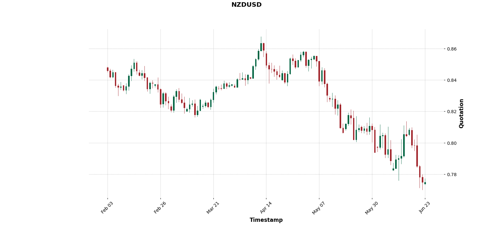

# <span style="font-size:1.5em;">FOREX DATA</span>

The forex_data package offers ways to aggregate data from the Forex market into a dataframe having the the essential OHLC information, so the ouput will always have the columns:

* timestamp
* open
* high
* low
* close

The first purpose is to aggregate data in OHLC format and allow to have data in any timeframe specified in the most simple and efficient way.
The second purpose is to manage one or multiple sources, an interface layer will have primary functions with predefined name, inputs and ouput results: in order to ease the access and usage of multiple data sources.

At the moment, sources are divided in **historical sources** and **real-time sources**.

## SOURCES

### HISTORICAL SOURCE

A historical source is a source of data which makes data available but does not have a defined update policy for design reasons
On the contrary, it can provide a ton of history data, tipically from the first years of 2000s and the free tier is fine for the purposes of the package.

A perfect data source of this type is [histdata.com](http://www.histdata.com/), which work is really genuine and a lot appreciated.

Summarizing, a historical source can provide tons of data even from many years ago and with no limits at the downside of a slow update rate. For example, *histdata* updates data on a montly basis.

### REAL-TIME SOURCE

A real-time source is what is more tipically known as a source for forex market or stock market data. It offers APIs in determined clients or even just a minimal documentation to establish the API call in HTTP request format.
A minimal free or trial offering is proposed, but they rely on premium subscriptions offers based on:

* real time performance 
* size of tickers list available
* how much history of a ticker 
* and many other parameters ...

As of now, just [alpha-vantage](https://www.alphavantage.co/documentation/) and [polygon-io](https://polygon.io/docs/forex/getting-started) are managed. The intention is to make the most out of them and their free tier access to data.

Even if free subscription is limitated for these providers, the reasons to include them in the package are to have closer real-time update than any historical source and also the module is designed to ease the work of studying a new provider API calls: a real time data manager uses at the same time all the remote sources available and provides access to their API through easier interface.

### Considerations

*What is the trade-off between historical and real-time source? And why a simultaneous usage of both is powerful?*

This question is the primary key of usefulness of the package.
An historical source like the one managed by the package, tipically updates data every month so you would have a delay of a month in retrieving the latest data, but on the upside you can have data from like 20 or more years ago to last month with a under a minute resolution.

A real-time source usually lets you get data limiting the number of candles of the output.
Also, tipically the source free subscription does not let to get data older than a month o few time more: especially if it requested with low resolution like 1-minute timeframe.
The real time source fills the gap of the month delay explained for the historical source.
And it is widely agreed that latest data have more influence on next trading positions to be set.

Concluding, the combination of historical and real-time source gives a 1-minute or lower resolution for data starting over 20 years ago approximately until yesterday or today data.


## INSTALLATION

The package is managed with Poetry, which is required to install the package.
Follow here for [installing Poetry](https://python-poetry.org/docs/).

Now, these steps should lead you to run the examples or any other package usage:

1. Open a shell (on Windows use [powershell7](https://learn.microsoft.com/it-it/powershell/scripting/install/installing-powershell-on-windows?view=powershell-7.4#msi)), clone the repository in a folder called `forex-data` (for example):
```
git clone https://github.com/nikfio/forex_data.git -b master forex-data
cd forex-data
```
2. Run poetry for package installation
```
poetry install
```
3. Run pytest to check everything is working fine
```
poetry run pytest
```

## CONFIGURATION FILE

A configuration file can be passed in order to group fixed parameters values.
In repository folder clone, look for [appconfig folder](appconfig) to see the [example template file](appconfig/appconfig_template.yaml).

In data managers instantiation, you can pass the YAML configuration file ending with `data_config.yaml` but any parameter value can be overridden by explicit assignment in object instantion.
The feature will be more clear following the [examples section](#examples).

#### ENGINE

Available options:

* pandas
* pyarrow
* polars

#### DATA_FILETYPE

Available options:

* csv
* parquet

*parquet* filetype is strongly suggested for read/write speed and disk space occupation.
Meanwhile, if you have any analysis application outside the Python environment, it would more likely accept csv files over parquet: so *csv* filetype could be a better choice for its broader acceptance.

#### PROVIDERS_KEY

To use real-time sources you need to provide an API key.

Look here to register and create a key from Alpha-Vantage provider
[Alpha-Vantage free API registration](https://www.alphavantage.co/support/#api-key)

Look here to register and create a key from Polygon-IO provider
[Polygon-IO home page](https://polygon.io/)

## LOGGING

Logging feature is added via loguru library.
By construction log is dumped in a file which location is determined by pathlib.
A generic usage folder for the package named `.database` is created at the current user home folder.
Here log is dumped in a file called `forexdata.log`, the complete location of the log file will be:

`~/.database/forexdata.log`


## EXAMPLES

You can find complete working examples in the [examples folder](examples/) showing the various modules and functionalities the package offers.

To run the examples:

```bash
# Historical data example
poetry run python examples/histdata_db_manager.py

# Real-time data example (requires API keys as environment variables)
export ALPHA_VANTAGE_API_KEY="your_key_here"
export POLYGON_IO_API_KEY="your_key_here"
poetry run python examples/realtime_data_manager.py
```

#### Historical data 

Let's walk through the [example for historical data source](examples/histdata_db_manager.py):

1. **Configuration setup**
    ```python
    # Use a runtime defined config yaml file
    test_config_yaml = '''
    DATA_FILETYPE: 'parquet'
    
    ENGINE: 'polars_lazy'
    '''
    ```
    You can define configuration inline or use a file. The configuration can override specific settings.
<br>

2. **Data manager instance** 
    ```python
    from forex_data import HistoricalManagerDB
    
    histmanager = HistoricalManagerDB(
        config=test_config_yaml
    )
    ```
    Create an instance of the historical data manager with your configuration.
<br>

3. **Get data**
    ```python
    ex_ticker = 'EURUSD'
    ex_timeframe = '1d'
    ex_start_date = '2018-10-03 10:00:00'
    ex_end_date = '2018-12-03 10:00:00'
    
    yeardata = histmanager.get_data(
        ticker=ex_ticker,
        timeframe=ex_timeframe,
        start=ex_start_date,
        end=ex_end_date
    )
    ```
    The call returns a dataframe with data having the timeframe, start, and end specified by the inputs.
    The output dataframe type depends on the engine selected (polars_lazy, polars, pandas, pyarrow).

    With `polars_lazy` as ENGINE option, the output dataframe:
    ```
    ┌─────────────────────┬─────────┬─────────┬─────────┬─────────┐
    │ timestamp           ┆ open    ┆ high    ┆ low     ┆ close   │
    │ ---                 ┆ ---     ┆ ---     ┆ ---     ┆ ---     │
    │ datetime[ms]        ┆ f32     ┆ f32     ┆ f32     ┆ f32     │
    ╞═════════════════════╪═════════╪═════════╪═════════╪═════════╡
    │ 2018-10-03 21:00:00 ┆ 1.1523  ┆ 1.1528  ┆ 1.1512  ┆ 1.1516  │
    │ 2018-10-04 21:00:00 ┆ 1.1516  ┆ 1.1539  ┆ 1.1485  ┆ 1.1498  │
    │ 2018-10-05 21:00:00 ┆ 1.1498  ┆ 1.1534  ┆ 1.1486  ┆ 1.1514  │
    │ ...                 ┆ ...     ┆ ...     ┆ ...     ┆ ...     │
    └─────────────────────┴─────────┴─────────┴─────────┴─────────┘
    ```
<br>

4. **Add a timeframe**
    ```python
    histmanager.add_timeframe('1W')
    ```
    Add a new timeframe. The data manager will create and cache the new timeframe data if not already present.
<br>

5. **Plot data**
    ```python
    histmanager.plot(
        ticker=ex_ticker,
        timeframe='1D',
        start_date='2016-02-02 18:00:00',
        end_date='2016-06-23 23:00:00'
    )
    ```
    Generate a candlestick chart for the specified ticker and date range.

<br>



<br>

#### Real-Time data

Let's walk through the [example for real-time data source](examples/realtime_data_manager.py):

**Important:** This example requires API keys set as environment variables:
```bash
export ALPHA_VANTAGE_API_KEY="your_alphavantage_key"
export POLYGON_IO_API_KEY="your_polygon_io_key"
```

1. **Configuration with API keys**
    ```python
    from os import getenv
    
    alpha_vantage_key = getenv('ALPHA_VANTAGE_API_KEY')
    polygon_io_key = getenv('POLYGON_IO_API_KEY')
    
    test_config_yaml = f'''
    DATA_FILETYPE: 'parquet'
    
    ENGINE: 'polars_lazy'
    
    PROVIDERS_KEY:
        ALPHA_VANTAGE_API_KEY : {alpha_vantage_key},
        POLYGON_IO_API_KEY    : {polygon_io_key}
    '''
    ```
    Configuration includes API keys for real-time data providers.
<br>

2. **Data manager instance**
    ```python
    from forex_data import RealtimeManager
    
    realtimedata_manager = RealtimeManager(
        config=test_config_yaml
    )
    ```
<br>

3. **Get last daily close**
    ```python
    ex_ticker = 'EURCAD'
    
    dayclose_quote = realtimedata_manager.get_daily_close(
        ticker=ex_ticker,
        last_close=True
    )
    ```
    
    Output:
    ```
    ┌─────────────────────┬─────────┬─────────┬─────────┬────────┐
    │ timestamp           ┆ open    ┆ high    ┆ low     ┆ close  │
    │ ---                 ┆ ---     ┆ ---     ┆ ---     ┆ ---    │
    │ datetime[ms]        ┆ f32     ┆ f32     ┆ f32     ┆ f32    │
    ╞═════════════════════╪═════════╪═════════╪═════════╪════════╡
    │ 2025-01-23 00:00:00 ┆ 1.4123  ┆ 1.4156  ┆ 1.4098  ┆ 1.4125 │
    └─────────────────────┴─────────┴─────────┴─────────┴────────┘
    ```

4. **Get daily close for last N days**
    ```python
    ex_n_days = 13
    
    window_daily_ohlc = realtimedata_manager.get_daily_close(
        ticker=ex_ticker,
        recent_days_window=ex_n_days
    )
    ```
    Returns the last 13 days of daily OHLC data.

5. **Get daily close for specific date range**
    ```python
    ex_start_date = '2025-01-15'
    ex_end_date = '2025-01-23'
    
    window_limits_daily_ohlc = realtimedata_manager.get_daily_close(
        ticker=ex_ticker,
        day_start=ex_start_date,
        day_end=ex_end_date
    )
    ```
    
    Output:
    ```
    ┌─────────────────────┬────────┬────────┬────────┬────────┐
    │ timestamp           ┆ open   ┆ high   ┆ low    ┆ close  │
    │ ---                 ┆ ---    ┆ ---    ┆ ---    ┆ ---    │
    │ datetime[ms]        ┆ f32    ┆ f32    ┆ f32    ┆ f32    │
    ╞═════════════════════╪════════╪════════╪════════╪════════╡
    │ 2025-01-23 00:00:00 ┆ 1.4125 ┆ 1.4156 ┆ 1.4098 ┆ 1.4132 │
    │ 2025-01-22 00:00:00 ┆ 1.4089 ┆ 1.4147 ┆ 1.4072 ┆ 1.4125 │
    │ 2025-01-21 00:00:00 ┆ 1.4112 ┆ 1.4134 ┆ 1.4063 ┆ 1.4089 │
    │ ...                 ┆ ...    ┆ ...    ┆ ...    ┆ ...    │
    └─────────────────────┴────────┴────────┴────────┴────────┘
    ```

6. **Get OHLC data with custom timeframe**
    ```python
    ex_start_date = '2024-04-10'
    ex_end_date = '2024-04-15'
    ex_timeframe = '1h'
    
    window_data_ohlc = realtimedata_manager.get_data(
        ticker=ex_ticker,
        start=ex_start_date,
        end=ex_end_date,
        timeframe=ex_timeframe
    )
    ```
    
    Output:
    ```
    Real time 1h window data: shape: (72, 5)
    ┌─────────────────────┬─────────┬─────────┬─────────┬─────────┐
    │ timestamp           ┆ open    ┆ high    ┆ low     ┆ close   │
    │ ---                 ┆ ---     ┆ ---     ┆ ---     ┆ ---     │
    │ datetime[ms]        ┆ f32     ┆ f32     ┆ f32     ┆ f32     │
    ╞═════════════════════╪═════════╪═════════╪═════════╪═════════╡
    │ 2024-04-10 00:00:00 ┆ 1.4765  ┆ 1.4768  ┆ 1.4752  ┆ 1.4761  │
    │ 2024-04-10 01:00:00 ┆ 1.4761  ┆ 1.4768  ┆ 1.4755  ┆ 1.4762  │
    │ 2024-04-10 02:00:00 ┆ 1.4762  ┆ 1.4778  ┆ 1.4751  ┆ 1.4771  │
    │ ...                 ┆ ...     ┆ ...     ┆ ...     ┆ ...     │
    └─────────────────────┴─────────┴─────────┴─────────┴─────────┘
    ```

7. **Intraday data with dynamic dates**
    ```python
    from pandas import Timestamp, Timedelta
    
    ex_start_date = Timestamp.now() - Timedelta('10D')
    ex_end_date = Timestamp.now() - Timedelta('8D')
    ex_timeframe = '5m'
    
    window_data_ohlc = realtimedata_manager.get_data(
        ticker='EURUSD',
        start=ex_start_date,
        end=ex_end_date,
        timeframe=ex_timeframe
    )
    ```
    Get 5-minute data for recent days using dynamic date calculations.


## PYTEST and pipeline implementation


## Performance considerations

Pandas is way too slow compared to PyArrow and Polars, by far.
Especially working with csv files and performing in-dataframe operations like the groupby on along timestamp column.

*Soon time based benchmarks will be provided to explictly show how much polars and pyarrow overcome pandas*

The battle between polars and pyarrow is still on.
Any suggestion on why one should choose pyarrow over polars or viceversa is welcome.

Or, a further data engine suggested could be taken into consideration to be integrated in the package.